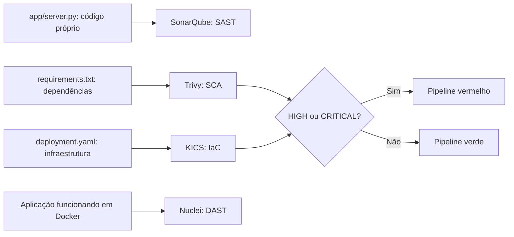

# CP01 DevSecOps — Grupo 2

Laboratório didático com **SonarQube Community, Trivy, KICS e Nuclei**.
Coordenação: Ronaldo. Validação do laboratório: Kauê. Documento: Edmario. Apresentação: Pedro.

## Comece aqui

- **Turma:** seguir [LAB.md](LAB.md). O laboratório principal usa Trivy + KICS e não exige Python instalado no computador.
- **Grupo:** ver [plano de responsabilidades](docs/PLANO-DO-GRUPO.md), [achados](evidencias/achados.md), [métricas](evidencias/metricas.md) e [pipeline](evidencias/pipeline.md).
- **Apresentação:** segunda, 28/09/2026, às 19h. Meta de fechamento: sábado, 26/09, às 19h.
- Este repositório contém a base técnica e evidências. Pesquisa acadêmica final, slides, vídeo e ensaio independente são entregas separadas ainda a concluir pelo grupo.

## Como o projeto funciona



`fixtures/vulneravel/` e `fixtures/corrigido/` contêm os estados antes/depois.
O Trivy analisa as versões declaradas de Jinja2 e MarkupSafe. O KICS lê um manifesto
Kubernetes: **nenhum cluster é criado e nenhum manifesto deve ser aplicado**.
O CI analisa a fixture selecionada, não todos os arquivos do repositório.

O Nuclei testa um único endpoint didático local com template próprio. O SonarQube
analisa `app/server.py`. São execuções complementares, fora do gate principal SCA/IaC.

## Resultados observados

| Ferramenta | Antes | Depois |
|---|---|---|
| Trivy | 3 MEDIUM no Jinja2 3.1.4 | 0 no conjunto de dependências declarado com Jinja2 3.1.6 |
| KICS | 2 HIGH, 1 MEDIUM e 6 LOW | 0 HIGH/CRITICAL, 1 MEDIUM e 5 LOW |
| Nuclei | 1 MEDIUM no `/debug` | 0 correspondências no mesmo template |
| SonarQube | S4790 (hash fraco) e S5332 (HTTP) | S4790 encerrada após SHA-256; S5332 permanece aberta |

Resultados de 25/09/2026. O banco do Trivy pode evoluir; a versão do scanner está fixada,
mas isso não congela novos avisos. Verde significa cumprir o gate HIGH/CRITICAL,
não ausência de todos os problemas. A análise SCA não cobre a imagem base do sistema operacional.

## Ambiente

Todas as imagens de ferramentas estão fixadas por versão e digest no Compose.
Trivy, KICS, Nuclei, Python e servidor SonarQube têm variante ARM64 utilizada no Mac.
O SonarScanner CLI fixado oferece AMD64 e roda por emulação neste Mac.

- Docker Desktop/Engine com Compose e Git para a turma.
- Python 3.10+ apenas para os scripts auxiliares usados pelo grupo; o CI já o fornece.
- Download das imagens e da base do Trivy antes da aula.
- SonarQube é opcional para a turma e usa H2 exclusivamente para avaliação local.

O projeto Compose se chama `cp01-devsecops`. Os alvos e o Nuclei ficam na rede interna
`cp01-devsecops_lab`, sem portas publicadas e sem saída direta para a internet.
Somente o painel SonarQube usa uma rede bridge com acesso em `http://127.0.0.1:19000`.
Seu `.env` contém credenciais locais geradas e está ignorado pelo Git.

## Executar a automação completa do grupo

Na raiz deste repositório:

```sh
docker compose pull trivy kics verify
docker compose run --rm trivy image --download-db-only
python3 scripts/run_scan.py vulneravel --offline
```

O último comando deve retornar **1**, por bloqueio de segurança. Em seguida:

```sh
python3 scripts/run_scan.py corrigido --offline
docker compose run --rm verify
```

Esperado: código **0**, com validação de ambos os estados. Erro operacional ou relatório
ausente retorna **2** no executor. Não mascarar saídas com `|| true`.

Para Nuclei, execução restrita aos dois alvos locais:

```sh
docker compose pull nuclei
docker compose --profile demo up -d --build --wait app-vulneravel app-corrigido
python3 scripts/run_dast.py
```

Para SonarQube:

```sh
docker compose pull sonarqube sonar-scanner
docker compose --profile sonar up -d sonarqube
python3 scripts/setup_sonar.py
python3 scripts/run_sonar.py
```

Se o servidor ainda estiver iniciando, aguardar `SonarQube is operational` em
`docker compose logs sonarqube` e repetir somente o setup. A primeira análise pode
demorar mais devido ao cache. Login do painel: `admin`; senha no `.env` local.

## GitHub Actions

Push em `main` e pull requests analisam o cenário corrigido. Em **Actions → Security gate → Run workflow**,
escolher `vulneravel` para a falha esperada ou `corrigido` para aprovação.
As duas execuções usam a mesma política. Os relatórios são preservados mesmo quando o job falha.
Não há deploy automático nem varredura contra sites externos.

## Arquivos e autoria

- `app/`: aplicação e Dockerfile.
- `fixtures/`: arquivos vulneráveis e corrigidos.
- `scripts/`: execução e verificação.
- `nuclei/`: template próprio e configuração explícita.
- `reports/`: saídas reais das quatro ferramentas.
- `evidencias/`: interpretação, medições e referências dos runs.
- `docs/`: material do grupo e futura pesquisa final.
- `USO-DE-IA.md`: assistência de IA e validações realizadas/pendentes.

Cada integrante deve registrar suas próprias contribuições. O histórico atual não substitui
o trabalho de documentação, apresentação e validação dos demais integrantes.

Para parar somente este projeto, na sua pasta:

```sh
docker compose --profile demo --profile sonar down
```

Esse comando preserva volumes e relatórios. Evitar `docker system prune`, que afeta outros projetos.
